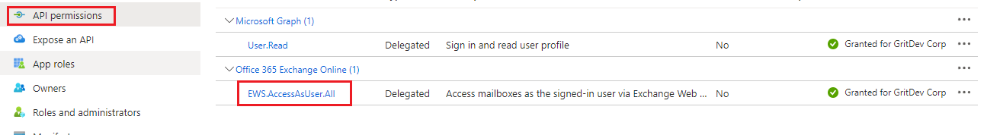
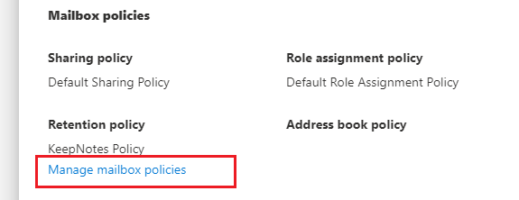
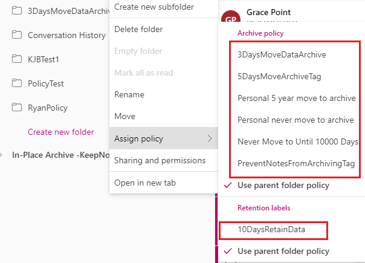
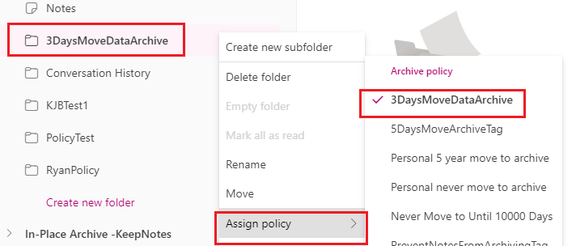
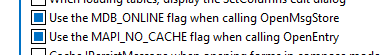
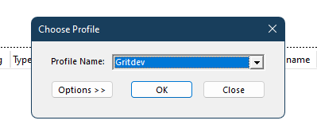
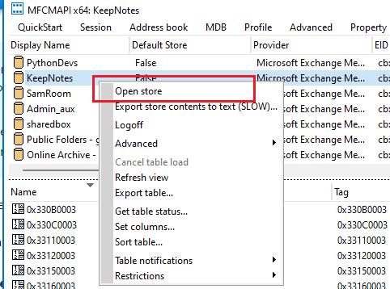
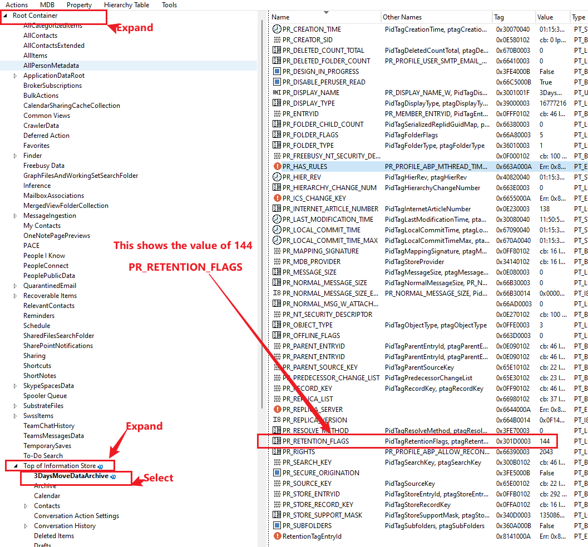

# Set-MailboxFolderPolicyTag

This document outlines the steps required to apply retention or archive policy tags to specific folders within a user’s mailbox or online archive using Exchange Online. This process involves configuring OAuth for secure access to Exchange Web Services (EWS), retrieving critical program parameters like the RetentionTag, RetentionFlags, and RetentionPeriod, and applying the correct policies to prevent or manage folder content retention.

The MRM Retention Policy is used to control how emails are retained, archived, or deleted in a user's mailbox. The steps provided guide users through the configuration of Azure AD application for OAuth, retrieving necessary parameters using PowerShell and MFCMAPI, and applying retention tags to prevent specific folders from moving to archive, or to enforce deletion policies on specific folders.

## Key Concept

> It is **not mandatory** for the tag that you want to apply to be present in the MRM Retention Policy already assigned to the user account.

## 🧩 Use Cases

* Prevent a specific folder from being moved to archive
* Move content of a specific folder to the online archive
* Apply a deletion policy to a specific folder

## Requirements

* OAuth-based authentication (Basic Auth is deprecated)
* MSAL.PS module must be installed
* EWS OAuth must be configured via Azure AD Application
* EWS Managed API (included in program folder)
* [MFCMAPI](https://github.com/stephenegriffin/mfcmapi/releases) to retrieve Retention Flag values

## Reminder on OAuth Setup

Follow this guide to configure OAuth for EWS:
🔗 [How to authenticate an EWS application by using OAuth](https://learn.microsoft.com/en-us/exchange/client-developer/exchange-web-services/how-to-authenticate-an-ews-application-by-using-oauth)

## Azure App Registration Steps

1. Go to [https://aad.portal.azure.com](https://aad.portal.azure.com)

2. Navigate to:
   **Azure Active Directory → App registrations → New registration**

3. Fill in the registration form:

   * **Name**: Friendly name of your choice
   * **Supported account types**: Single tenant or as per your need
   * **Redirect URI**:

     * Platform: *Public client (mobile & desktop)*
     * URI: `https://login.microsoftonline.com/common/oauth2/nativeclient`

4. Click **Register**

5. Save the following values from the overview:

   * Application (Client) ID
   * Directory (Tenant) ID

### Configure Delegated Permissions

1. Go to **Manifest** of your app
   

2. Modify the `requiredResourceAccess` section:

```json
"requiredResourceAccess": [
  {
    "resourceAppId": "00000002-0000-0ff1-ce00-000000000000",
    "resourceAccess": [
      {
        "id": "3b5f3d61-589b-4a3c-a359-5dd4b5ee5bd5",
        "type": "Scope"
      }
    ]
  }
],
```

3. Save the manifest
4. Confirm `EWS.AccessAsUser.All` is shown under API Permissions
   

## Setup Test Mailbox (Optional)

1. Create a test or shared mailbox
2. Assign full access to the admin or delegate account

## Create Personal Retention Tag

1. Go to: [Microsoft Purview Portal](https://compliance.microsoft.com)

2. Navigate: **Data lifecycle management → Exchange (legacy)** > Create a new **personal tag** > Create a new MRM **retention policy** >  Add the personal tag to the policy
    
3. Assign this policy to your test mailbox

    > If a retention policy includes both retention and archive personal tags, only the **retention tags** will be exposed in the mailbox's MRM configuration when the archive mailbox is not provisioned. **Archive personal tags** are not published to mailboxes without an enabled archive, as they are scoped exclusively for the archive mailbox.

    From **Exchange admin center** > Recipients > Mailboxes > Select **mailboxes** > choose the **test mailbox** or **shared mailbox** >
    - In the side pop-up menu, Select **Mailbox** tab > Under the **Mailbox policies** > Click **Manage retention policies** under **Retention policy** section > Select the custom retention policy > Save
      
    - Allow some time for the changes to propagate and the personal policy tags will show in the mailbox. Eg
    
    - Outlook on the web view for the assigned policy to the folder _**3DaysMoveDataArchive**_.
      

🧠 **Note:** Archive tags will not appear in Outlook if archive is disabled.

## Retrieve PR\_RETENTION\_FLAGS Value Using MFCMAPI

1. Add the test mailbox to Outlook Desktop

2. Open **MFCMAPI**

3. In MFCMAPI, go to **Options** and enable:
   
   * *Use MDS ONLINE flag when calling OpenMsgStore*
   * *Use MAPI\_NO CACHE flag when calling OpenEntry*
     

4. Go to `Session → Logon`
   

5. Expand the mailbox store
   

6. Navigate: `Root Container → Top of Information Store → [Target Folder]`

7. Find `PR_RETENTION_FLAGS` and copy the value (e.g., 144)
   

## Required Parameters

| Parameter                             | Description                                    |
| - | - |
| `TargetFolderName`                    | Folder to apply the policy to                  |
| `ArchiveOrRetentionTagRawRetentionId` | GUID from `Get-RetentionPolicyTag`             |
| `RetentionFlagsValue`                 | Value retrieved from MFCMAPI                   |
| `ArchiveOrRetentionPeriodInDays`      | Retention duration                             |
| `TenantInitialDomain`                 | Tenant default domain                          |
| `AzureEWSApplicationClientId`         | Client ID from Azure App                       |
| `TargetUserAccountsCsv`               | Path to CSV file of UPNs                       |
| `TargetFolderLocation`                | `PrimaryMailBox` (default) or `ArchiveMailBox` |
| `ArchiveOrRetainAction`               | `ArchiveAction` (default) or `RetentionAction` |

## Script Execution

### Option 1 – Using Config File

Save parameters in a file `EWSRequiredParameters.txt`:

```ini
TargetFolderName = ValliPolicy
ArchiveOrRetentionTagRawRetentionId = 11111111-1111-1111-1111-111111111111
RetentionFlagsValue = 153
ArchiveOrRetentionPeriodInDays = 3
TenantInitialDomain = JesusIsTheWay.onmicrosoft.com
AzureEWSApplicationClientId = 22222222-2222-2222-2222-222222222222
TargetUserAccountsCsv = .\UserAccounts.txt
TargetFolderLocation = PrimaryMailBox
ArchiveOrRetainAction = ArchiveAction
```

Then run:

```powershell
.\Set-MailboxFolderPolicyTag.ps1 -UserPredefinedConfigData
```

### Option 2 – Using Inline Parameters

```powershell
.\Set-MailboxFolderPolicyTag.ps1 `
  -TargetFolderName "ValliPolicy" `
  -ArchiveOrRetentionTagRawRetentionId "11111111-1111-1111-1111-111111111111" `
  -RetentionFlagsValue 153 `
  -ArchiveOrRetentionPeriodInDays 3 `
  -TenantInitialDomain "JesusIsTheWay.onmicrosoft.com" `
  -AzureEWSApplicationClientId "22222222-2222-2222-2222-222222222222" `
  -TargetUserAccountsCsv ".\UserAccounts.txt" `
  -TargetFolderLocation "PrimaryMailBox" `
  -ArchiveOrRetainAction "ArchiveAction"
```


## ⚙️ Default Values

| Parameter               | Default          |
| ----------------------- | ---------------- |
| `TargetFolderLocation`  | `PrimaryMailBox` |
| `ArchiveOrRetainAction` | `ArchiveAction`  |

## 🙏 Credits and Appreciation

* **Jad** — Helped review and test the script
* **Akashb** — Original blog and example

  - [Stamping Archive Policy Tag using EWS Managed API from PowerShell (Exchange 2010)](https://learn.microsoft.com/en-us/archive/blogs/akashb/stamping-archive-policy-tag-using-ews-managed-api-from-powershellexchange-2010)
  - [Stamping Retention Policy Tag using EWS Managed API 1.1 from PowerShell (Exchange 2010)](https://learn.microsoft.com/en-us/archive/blogs/akashb/stamping-retention-policy-tag-using-ews-managed-api-1-1-from-powershellexchange-2010)

## References

- [Stamping Archive Policy Tag using EWS Managed API from PowerShell (Exchange 2010)](https://learn.microsoft.com/en-us/archive/blogs/akashb/stamping-archive-policy-tag-using-ews-managed-api-from-powershellexchange-2010)
- [Stamping Retention Policy Tag using EWS Managed API 1.1 from PowerShell (Exchange 2010)](https://learn.microsoft.com/en-us/archive/blogs/akashb/stamping-retention-policy-tag-using-ews-managed-api-1-1-from-powershellexchange-2010)
- [OAuth 2.0 authentication with Azure Active Directory](https://learn.microsoft.com/en-us/azure/active-directory/fundamentals/auth-oauth2)
- [Authentication and EWS in Exchange](https://learn.microsoft.com/en-us/exchange/client-developer/exchange-web-services/authentication-and-ews-in-exchange)
- [Authenticate an EWS application by using OAuth](https://learn.microsoft.com/en-us/exchange/client-developer/exchange-web-services/how-to-authenticate-an-ews-application-by-using-oauth)
- [Understanding Retention Tags and Retention Policies](https://technet.microsoft.com/en-us/library/dd297955.aspx)
- [Deploying Messaging Records Management](https://technet.microsoft.com/en-us/library/bb123548.aspx)
- [Messaging Records Management (MRM) and Retention Policies in Microsoft 365](https://learn.microsoft.com/en-us/microsoft-365/troubleshoot/retention/mrm-and-retention-policy)
